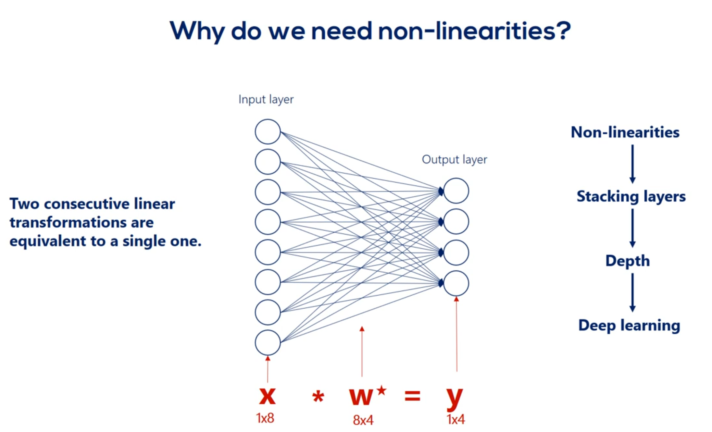

# TensorFlow

## Simple Linear Regression. 

### Minimal Example

1. Import the relevant libraries

``` py
import numpy as np
import matplotlib.pyplot as plt
from mpl_toolkits.mplot3d import Axes3D
```

2. Generate random input data to train on

```py 
observations = 1000
xs = np.random.uniform(low=-10, high=10, size=(observations, 1))
zs = np.random.uniform(-10,10,(observations, 1))

inputs = np.column_stack((xs, zs))

print(inputs.shape)
print(inputs)
``` 
Output is a matrix of size (1000,2)
``` 
(1000, 2)
```
``` 
[[ 7.44651066  3.0441044 ]
 [ 3.18741031 -6.10663328]
 [ 7.47234553  6.86829353]
 ...
 [ 4.3408767   2.59859389]
 [ 5.96692549 -1.95235124]
 [ 6.43664934 -8.52279315]]
```


|Elements of the model in supervised learning|Status|
|:-----:|:---:|
|inputs |done |
|weights|  Computer   |
|biases |  Computer    |
|outputs|  Computer    |
|targets|to do|

Targets = $f(x,z) = 2x - 3z + 5 + noise$

Where 2 is the first weight$(W_1)$ 3 is the second weight$(W_2)$ and 5$(b)$ is the baias. 

The noise is introduced to randomize the data.

3. Create the targets we will aim at
```py 
noise = np.random.uniform(-1, 1, (observations, 1))

targets = 2*xs - 3*zs + 5 + noise

# the targets are a linear combination of two vectors 1000x1 
# a scalar and noise 1000x1, their shape should be 1000x1

print(targets.shape)
```
Output the shape of the targets, a matrix 1000x1
``` 
(1000, 1)
```

4. Plot the training data

```py 
# In order to use the 3D plot, the objects should have a certain shape, so we reshape the targets.
# The proper method to use is reshape and takes as arguments the dimensions in which we want to fit the object.
targets = targets.reshape(observations,)

# Plotting according to the conventional matplotlib.pyplot syntax

# Declare the figure
fig = plt.figure()

# A method allowing us to create the 3D plot
ax = fig.add_subplot(111, projection='3d')

# Choose the axes.
ax.plot(xs, zs, targets)

# Set labels
ax.set_xlabel('xs')
ax.set_ylabel('zs')
ax.set_zlabel('Targets')

# You can fiddle with the azim parameter to plot the data from different angles. Just change the value of azim=100
# to azim = 0 ; azim = 200, or whatever. Check and see what happens.
ax.view_init(azim=100)

# So far we were just describing the plot. This method actually shows the plot. 
plt.show()

# We reshape the targets back to the shape that they were in before plotting.
# This reshaping is a side-effect of the 3D plot. Sorry for that.
targets = targets.reshape(observations,1)
```
Clean code
```py 
targets = targets.reshape(observations,)
fig = plt.figure()
ax = fig.add_subplot(111, projection='3d')
ax.plot(xs, zs, targets)
ax.set_xlabel('xs')
ax.set_ylabel('zs')
ax.set_zlabel('Targets')
ax.view_init(azim=100)
plt.show()
targets = targets.reshape(observations, 1)
```

<br>
<div style="text-align: center;">

</div>
<br>

5. Create weights

```py 
# our initial weights and biases will be picked randomly from
# the interval minus 0.1 to 0.1.
init_range = 0.1
#The size of the weights matrix is two by one as we
# have two variables so there are two weights one for#
#each input variable and a single output.
weights = np.random.uniform(-init_range, init_range, size=(2, 1))

print(f'Weights: {weights}')
```
6. Create Biases

```py 
#Let's declare the bias and illogically the appropriate shape is one by one.
#So the bias is a scalar in machine learning.
#There are many biases as there are outputs.
#Each bias refers to an output.
biases = np.random.uniform(-init_range, init_range, size=1)

print(f'Biases: {biases}')
```

``` 
Weights: [[-0.07021836]
 [ 0.00626743]]
Biases: [-0.01464248]
```

7. Set a learning rate

```py 
learning_rate = 0.02
```

So we are all set.
We have inputs targets and arbitrary numbers for weights and biases.
What is left is to vary the weights and biases so our outputs are closest to the targets as we know by now.
The problem boils down to minimizing the loss function with respect to the weights and the biases.
And because this is a regression we'll use one half the L2 norm loss function.

<br>

Next let's make our model learn.

<br>

Since this is an iterative problem.
We must create a loop which will apply our update rule and calculate the last function.

I'll use a for loop with 100 iterations to complete this task.
Let's see the game plan will follow:

* At each iteration We will calculate the outputs 

* and compare them to the targets through the last function.

* We will print the last for each iteration so we know how the algorithm is doing.

* Finally we will adjust the weights and biases to get a better fit of the data.

* At the next iteration these updated weights and biases will provide different outputs. 
* Then the procedure will be repeated.


Now the dot product of the input times the weights is 1000 by two times to buy one.
So a 1000 by 1 matrix when we add the bias which is a scalar.
Python adds the element wise.
This means it is added to each element of the output matrix.

```py 
for i in range(100):
    outputs = np.dot(inputs, weights) + biases
```

OK for simplicity let's declare a variable called deltas which will record the difference between the
outputs and the targets.
We already introduce such variable in the gradient descent lecture deltas equals outputs minus targets.
That's useful as it is a part of the update rule.
Then we must calculate the loss.

```py 
deltas = outputs - targets
```

<br>

L2-norm loss formula:

$\sum _i(y_i - t_i)^2$

We said we will use half the L2 norm loss.
Python actually speaking deltas is a 1000 by one array.
We are interested in the sum of its terms squared.
Following the formula for the L2 norm loss there is a num PI method called sum which will allow us to
sum all the values in the array the L2 norm requires these values to be squared.
So the code looks like this.
And P does some of Delta squared.
We then divide the whole expression by two to get the elegant update rules from the gradient descent.
Let's further augment the loss by dividing it by the number of observations we have.
This would give us the average loss per observation or the mean loss.
Similarily to the division by 2.
This does not change the logic of the last function.
It is still lower than some more accurate results that will be obtained.
This little improvement makes the learning independent of the number of observations instead of adjusting
the learning rate.
We adjust the loss that that's valuable as the same learning rate should give us similar results for
both 1000 and 1 million observations.

```py 
loss = np.sum(deltas ** 2) / 2 / observations
```

We'll print the last we've obtained each step.
That's done as we want to keep an eye on whether it is decreasing as iterations are performed.
If it is decreasing our machine learning algorithm functions well.

```py 
print(loss)
```

Finally we must update the weights and biases so they are ready for the next iteration using the same
rescaling trick.
I'll also reskill the deltas.
This is yet another way to make the algorithm more universal.
So the new variable is deltas underscored skilled and equals deltas divided by observations.

```py 
deltas_scaled = deltas / observations
```

Let's update the weights.
We will follow the gradient descent logic.

$w_{i+1} = w_i - \eta \sum _i x_i \delta_i$

The new weights are equal to the old weights minus the learning rate times the dot product of the inputs
and the Deltas underscored scaled.
The shape of the weights is two by one the shape of the inputs is one thousand by two and that of the
Delta skilled is one thousand by one.
Obviously we cannot simply multiply the inputs and the deltas.
This is an issue that may arise occasionally due to the linear algebra involved to fix it.
We must transpose the inputs matrix using the object but the method.
Now the major C's are compatible.
By 1000 times 1000 by one is equal to 2 by 1.

```py 
weights = weights - learning_rate * np.dot(inputs.T, deltas_scaled)
```

:::tip
Often when dealing with matrices you find the correct way to code it through dimensionality checks and
compatability errors.

However transposing major C's doesn't affect the information they hold so we can do it freely.
:::


All right let's update the biases.
The new biases are equal to the old biases minus the learning rate times the sum of the deltas as explained
in the gradient descent lecture.

```py 
biases = biases - learning_rate * np.sum(deltas_scaled)
```

This is the entire algorithm.
Let's recap what it does: 

1. first it calculates the outputs forgiven weights and biases.
2. Second it calculates a loss function that compares the outputs to the targets.
3. Third it prints the loss. So we can later analyze it and 
4. forth, We update the weights and the bias is following the gradient descent methodology.


Let's run the code.
What we get is a list of numbers that appears to be in descending order right.
These are the values of our average last function.
It started from a high value and at each iteration it became lower and lower until it reached a point
where it almost stopped changing.
This means we have minimized or almost minimize the loss function with respect to the weights and biases.
Therefore we have found a linear function that fits the model Well

``` 
113.1346113499832
108.21425084240616
103.88888353315217
99.7849517016046
95.84949440054764
92.0702726846745
88.4404105995388
84.95392016265656
81.60512775430881
78.38859366840362
75.29909427907384
72.33161242080419
69.4813290972211
66.74361563721006
64.11402617596718
61.58829043492039
59.162306787044116
56.83213559608488
54.59399281885322
52.444243860188884
50.3793976706198
48.39610107712963
46.491133337827655
44.66140091167794
42.90393243479416
41.21587389514219
39.594483997814095
38.03712971334737
36.54128200186008
35.104511706058084
33.72448560644502
32.39896263232881
31.125790222471856
29.902900829474543
28.728308562215652
27.600105960897142
26.516460899456188
25.475613610314117
24.475873826630895
23.515618037423987
22.593286851094458
21.707382463078588
20.856466223512808
20.03915630096189
19.25412543841651
18.500098797916074
17.77585189029656
17.080208586701485
16.41203920862674
15.77025869339785
15.153824832100188
14.561736577101016
13.993032416414623
13.446788812270727
12.922118701350518
12.418170054254773
11.934124491864695
11.469195956348635
11.022629434656377
10.59369973242813
10.181710296327049
9.785992082882911
9.40590247200998
9.040824223434672
8.690164474338356
8.353353776587563
8.029845171988013
7.719113304060869
7.42065356489872
7.133981275715881
6.858630899762206
6.594155286322381
6.34012494457287
6.096127346117317
5.861766255067884
5.636661084584468
5.420446278826976
5.212770719316917
5.013297154744328
4.8217016532940695
4.637673076602049
4.460912574487216
4.291133099638719
4.128058941470141
3.9714252783838333
3.8209777477182216
3.676472032679767
3.537673465588702
3.4043566467943345
3.276305078640973
3.153310813890127
3.0351741180280087
2.921703144909945
2.812713625215003
2.7080285672048383
2.607477969300881
2.5108985440130636
2.4181334527717953
2.3290320512325318
2.2434496446393806
```


The weights and the biases are optimize.
But so are the outputs.
Since the optimization process has ended.
We can check these values here.
We observe the values from the last iteration of the for loop.
The one that gave us the lowest last function in the memory of the computer the weights biases and outputs
variables are optimized as of now.
Congratulations you learn how to create your first machine learning algorithm.

<br>

Still let's spend an extra minute on that.
I'd like to print the weights and the bias's the weights seem about right.
The bias is close to five as we wanted but not really.
That's because we use too few iterations or an inappropriate learning rate.
Let's rerun the code for the loop.
This will continue optimizing the algorithm for another hundred iterations.
We can see the bias improves when we increase the number of iterations.
We strongly encourage you to play around with the code and find the optimal number of iterations for
the problem.
Try different values for observations learning rate number of iterations maybe even initial range for
initializing the weights and biases cool.

```py 
print(f'Weights: {weights}')
print(f'Biases: {biases}')
```
Targets = $f(x,z) = 2x - 3z + 5 + noise$
``` 
Weights: [[ 1.9962384 ]
 [-3.00212515]]
Biases: [5.28171043]
```
``` 
Weights: [[ 1.99842328]
 [-3.00330109]]
Biases: [5.01471378]
```

Finally I'd like to show you the plot of the output at the last iteration against the targets.
The closer this plot is to a 45 degree line the closer the outputs are to the targets.
Obviously our model worked like a charm.


<br>
<div style="text-align: center;">

</div>
<br>


## Solving the simple example using TensorFlow

```py 
#%%
import numpy as np
import matplotlib.pyplot as plt
import tensorflow as tf

#%%
# 2. Data generation

observations = 1000
xs = np.random.uniform(low=-10, high=10, size=(observations, 1))
zs = np.random.uniform(-10, 10, (observations, 1))

generated_inputs = np.column_stack((xs, zs))

noise = np.random.uniform(-1, 1, (observations, 1))

generated_targets = 2*xs - 3*zs + 5 + noise

np.savez('TF_intro', inputs=generated_inputs, targets=generated_targets)
#%%
# 3. Solving with TensorFlow

training_data = np.load('TF_intro.npz')

input_size = 2
output_size = 1

# tf.keras.Sequential() function that specifies how the model
# will be laid down ('stack layers')
# Linear combination + Output = Layer*

# The tf.keras.layers.Dense(output size)
# takes the inputs provided to the model
# and calculates the dot product of the inputs and weights and adds the bias
# It would be the output = np.dot(inputs, weights) + bias

model = tf.keras.Sequential([
    tf.keras.layers.Dense(output_size)
])

# model.compile(optimizer, loss) configures the model for training
# https://www.tensorflow.org/api_docs/python/tf/keras/optimizers
# L2-norm loss = Least sum of squares (least sum of squared error)
# scaling by #observations = average (mean)

model.compile(optimizer='sgd', loss='mean_squared_error')

# What we've got left is to indicate to the model which data to fit
# modelf.fit(inouts, targets) fits (trains) the model.
# Epoch = iteration over the full dataset

model.fit(training_data['inputs'], training_data['targets'], epochs=100, verbose=2)


#%%
# 4. Extract the weights and bias

model.layers[0].get_weights()

weights = model.layers[0].get_weights()[0]
print(f'weights: {weights}')

biases = model.layers[0].get_weights()[1]
print(f'biases: {biases}')

#%%

# 5. Extract the outputs (make predictions)
# model.predict_on_batch(data) calculates the outputs given inputs
# these are the values that were compared to the targets to evaluate the loss function
print(model.predict_on_batch(training_data['inputs']).round(1))

print(training_data['targets'].round(1))

#%%

# 6. Plotting
# The line should be as close to 45 as possible
plt.plot(np.squeeze(model.predict_on_batch(training_data['inputs'])), np.squeeze(training_data['targets']))
plt.xlabel('Outputs')
plt.ylabel('Targets')
plt.show()
```

<br>
<div style="text-align: center;">

</div>
<br>

### Making the model closer to the Numpy example

```py {41,42,45,52} 
import numpy as np
import matplotlib.pyplot as plt
import tensorflow as tf

#%%
# 2. Data generation

observations = 1000
xs = np.random.uniform(low=-10, high=10, size=(observations, 1))
zs = np.random.uniform(-10, 10, (observations, 1))

generated_inputs = np.column_stack((xs, zs))

noise = np.random.uniform(-1, 1, (observations, 1))

generated_targets = 2*xs - 3*zs + 5 + noise

np.savez('TF_intro', inputs=generated_inputs, targets=generated_targets)
#%%
# 3. Solving with TensorFlow

training_data = np.load('TF_intro.npz')

input_size = 2
output_size = 1

# tf.keras.Sequential() function that specifies how the model
# will be laid down ('stack layers')
# Linear combination + Output = Layer*

# The tf.keras.layers.Dense(output size)
# takes the inputs provided to the model
# and calculates the dot product of the inputs and weights and adds the bias
# It would be the output = np.dot(inputs, weights) + bias

# tf.keras.layers.Dense(output_size, kernel_initializer, bias_initializer)
# function that is laying down the model (used tp 'stack layers') and initialize weights

model = tf.keras.Sequential([
    tf.keras.layers.Dense(output_size,
                          kernel_initializer=tf.random_uniform_initializer(minval=-0.1, maxval=0.1),
                          bias_initializer=tf.random_uniform_initializer(minval=-0.1, maxval=0.1))
])

custom_optimizer = tf.keras.optimizers.SGD(learning_rate=0.02)

# model.compile(optimizer, loss) configures the model for training
# https://www.tensorflow.org/api_docs/python/tf/keras/optimizers
# L2-norm loss = Least sum of squares (least sum of squared error)
# scaling by #observations = average (mean)

model.compile(optimizer=custom_optimizer, loss='mean_squared_error')

# What we've got left is to indicate to the model which data to fit
# modelf.fit(inouts, targets) fits (trains) the model.
# Epoch = iteration over the full dataset

model.fit(training_data['inputs'], training_data['targets'], epochs=100, verbose=2)


#%%
# 4. Extract the weights and bias

model.layers[0].get_weights()

weights = model.layers[0].get_weights()[0]
print(f'weights: {weights}')

biases = model.layers[0].get_weights()[1]
print(f'biases: {biases}')

#%%

# 5. Extract the outputs (make predictions)
# model.predict_on_batch(data) calculates the outputs given inputs
# these are the values that were compared to the targets to evaluate the loss function
print(model.predict_on_batch(training_data['inputs']).round(1))

print(training_data['targets'].round(1))

#%%

# 6. Plotting
# The line should be as close to 45 as possible
plt.plot(np.squeeze(model.predict_on_batch(training_data['inputs'])), np.squeeze(training_data['targets']))
plt.xlabel('Outputs')
plt.ylabel('Targets')
plt.show()
```
<br>
<div style="text-align: center;">

</div>
<br>

<br>
<div style="text-align: center;">

</div>
<br>

## Going deeper Introduction to deep neural networks

Mixing linear combinations and non-linearities allows us to model arbitrary functions.

<br>

The layer is the building block of neural networks.
The initial linear combinations and the added non-linearity form a layer.

<br>
<div style="text-align: center;">

</div>
<br>

When we have more then one layer, we are talking about neural network.

<br>
<div style="text-align: center;">

</div>
<br>


<br>
<div style="text-align: center;">

</div>
<br>


<br>
<div style="text-align: center;">

</div>
<br>


<br>
<div style="text-align: center;">

</div>
<br>


<br>
<div style="text-align: center;">

</div>
<br>

We refer to the width and depth (but not only) as hyperparameters

<br>
<div style="text-align: center;">

</div>
<br>

<br>
<div style="text-align: center;">

</div>
<br>

Each arrow represents the mathematical transformation of a certain value

So a certain way is applied then a non-linearity is added know that the non-linearity doesn't change
the shape of the expression it only changes its linearity.


<br>
<div style="text-align: center;">

</div>
<br>

For example weight 3 6 is applied to the third input and is involved in calculating the 6th hidden unit in the same way,
Weights 1 6 2 6 and so on until 8 6 all participate in computing the sixth hit and unit.
**They are linearly combined**.
And then **nonlinearity is added** in order to produce the sixth hidden unit in the same way we get each of the
other hidden units.

<br>
<div style="text-align: center;">

</div>
<br>

<br>
<div style="text-align: center;">

</div>
<br>

Well then we have the first hit and we're using the same logic we can linearly combine the hidden units
and apply a nonlinearity right.
Indeed this time though there are nine input hit in units and none output hit in units.
Therefore the weights will be contained in a 9 by 9 matrix and there will be 81 arrows.
Finally we applied nonlinearity and we reached the second hidden layer.
We can go on and on and on like this we can add a hundred hidden layers if we want.
That's a question of how deep we want our deep net to be.


<br>
<div style="text-align: center;">

</div>
<br>


Finally we'll have the last hidden layer when we apply the operation once again we will reach the output
layer the output units depend on the number of outputs we would like to have in this picture.
There are four.
They may be the temperature humidity precipitation and pressure for the next day.
To reach this point we will have a nine by four Waite's matrix which refers to 36 arrows or 36 weights
exactly what we expected.


<br>
<div style="text-align: center;">

</div>
<br>


All right as before our optimization goal is finding values for major cities that would allow us to
convert inputs into correct outputs as best as we can.
This time though we are not using a single linear model but a complex infrastructure with a much higher
probability of delivering a meaningful result.


<br>
<div style="text-align: center;">

</div>
<br>

We said non-linearities are needed so we can represent more complicated relationships.
While that is true it isn't the full picture an important consequence of including non-linearities is **the ability to stack Layers stacking layers is the process of placing one layer after the other in a meaningful way. Remember that it's fundamental.**

<br>

**We cannot stack layers when we only have linear relationships.**

<br>

<br>
<div style="text-align: center;">

</div>
<br>

<br>
<div style="text-align: center;">

</div>
<br>

The point we will make is that we cannot stack Lears when we have only linear relationships.
Let's prove it.
Imagine we have a single hidden layer and there are no non-linearities.
So our picture looks this way.
There are eight input nodes nine head and nodes in the hidden layer and four output nodes.
Therefore we have an eight by nine Waites matrix.
When your relationship between the input layer and the hidden layer Let's call this matrix W. one.
The hidden units age according to the linear model H is equal to x times w 1.
Let's ignore the biases for a while.
So our hidden units are summarized in the matrix H with a shape of one by nine.
Now let's get to the output layer from the hidden layer once again according to the linear model Y is
equal to h times W2 we have W2 as these weights are different.
We already know the H matrix is equal to x times.
W1 Right.
Let's replace h in this equation Y is equal to x times w 1 times.
W2 but w 1 and w 2 can be multiplied right.
What we get is a combined matrix W star with dimensions 8 by 4 well then our deep net can be simplified
into a linear model which looks this way y equals x times w star knowing that we realize the hidden
layer is completely useless in this case.
We can just train this simple linear model and we would get the same result in mathematics.
This seems like an obvious fact but in machine learning it is not so clear from the beginning.
The two consecutive linear transformations are equivalent to a single one.
Even if we add 100 layers the problem would be simplified to a single transformation.
That is the reason we need non-linearities.
Without them stacking layers one after the other is meaningless and without stacking layers we will
have no depth.
What's more with no depth.
Each and every problem will equal the simple linear example we did earlier.
And many practitioners would tell you it was borderline machine learning.
All right let's summarize in one sentence.

<br>

**You have deep nets and find complex relationships through arbitrary functions.
We need non-linearities.**

<br>
<div style="text-align: center;">

</div>
<br>

Point taken.

Non-linearities are also called activation functions.
Henceforth that's how we will refer to them activation functions transform inputs into outputs of a different kind.

<br>
<div style="text-align: center;">

</div>
<br>


Think about the temperature outside.
I assume you wake up and the sun is shining.
So you put on some light clothes you go out and feel warm and comfortable.
You carry your jacket in your hands in the afternoon the temperature starts decreasing.
Initially you don't feel a difference at some point though your brain says it's getting cold.
You listen to your brain and put on your jacket the input you got was the change in the temperature
the activation function transformed this input into an action put on the jacket or continue carrying
it.
This is also the output after the transformation.
It is a binary variable jacket or no jacket.
That's the basic logic behind nonlinearities the change in the temperature was following a linear model

**as it was steadily decreasing the activation function transformed this relationship into an output linked
to the temperature but was of a different kind**

<br>
<div style="text-align: center;">

</div>
<br>


its derivative as you may recall the derivative is an essential part of the gradient
descent.
Naturally when we work with tenths or flow we won't need to calculate the derivative as tenths or flow.
Does that automatically Anyhow the purpose of this lesson is understanding these functions.
There are graphs and ranges in a way that would allow us to acquire intuition about the way they behave.
Here's the functions graph.
And finally we have it's range.
Once we have applied the sigmoid as an activator all the outputs will be contained in the range from
0 to 1.
So the output is somewhat standardized.
All right here are the other three common activators the Tench also known as the hyperbolic tangent.
The real Lu aka the rectified linear unit and the soft Max activator you can see their formulas derivatives
graphs and ranges.
The saaf next graph is not missing.
The reason we don't have it here is that it is different every time.
Pause this video for a while and examine the table in more detail.
You can also find this table in the course notes.
So all these functions are activators right.
What makes them similar.
Well let's look at their graphs all Armano tonic continuous and differentiable.
These are important properties needed for the optimization process as we are not there yet.
We will leave this issue for later.


<br>
<div style="text-align: center;">

</div>
<br>

Before we conclude I would like to make this remark.
Activation functions are also called transfer functions because of the transformation properties.
The two terms are used interchangeably in machine learning context but have differences in other fields.
Therefore to avoid confusion we will stick to the term activation functions. 

###  softmax function

Let's continue exploring this table which contains mostly Greek letters we said the soft max function
has no definite graph y so while this function is different if we take a careful look at its formula
we would see the key difference between this function and the other is it takes an argument the whole
vector A instead of individual elements.
So the self max function is equal to the exponential of the element at position.
I divided by the sum of the exponentials of all elements of the vector.
So while the other activation functions get an input value and transform it regardless of the other
elements the SAAF Max considers the information about the whole set of numbers we have.


<br>
<div style="text-align: center;">

</div>
<br>


A key aspect of the soft Max transformation is that the values it outputs are in the range from 0 to 1.
There is some is exactly 1 What else has such a property.
Probabilities Yes probabilities indeed.
The point of the soft Max transformation is to transform a bunch of arbitrarily large or small numbers
that come out of previous layers and fit them into a valid probability distribution.
This is extremely important and useful.


<br>
<div style="text-align: center;">

</div>
<br>

Remember our example with cats dogs and horses we saw earlier.
One photo was described by a vector containing 0.1 0.2 and 0.7.
We promise we will tell you how to do that.
Well that's how through a soft Max transformation we kept our promise now that we know we are talking
about probabilities we can comfortably say we are 70 percent certain the image is a picture of a horse.
This makes everything so intuitive and useful that the SAAF next activation is often used as the activation
of the final output layer and classification problems.
So no matter what happens before the final output of the algorithm is a probability distribution.


<br>
<div style="text-align: center;">

</div>
<br>

### Backpropagation

<br>
<div style="text-align: center;">

</div>
<br>

First I'd like to recap what we know so far we've seen and understood the logic of how layers are stacked.

<br>
<div style="text-align: center;">

</div>
<br>


We've also explored a few activation functions and spent extra time showing they are central to the concept of stacking layers.

<br>
<div style="text-align: center;">

</div>
<br>

<br>
<div style="text-align: center;">

</div>
<br>

<br>
<div style="text-align: center;">

</div>
<br>

Moreover by now we have said 100 times that the training process consists of updating parameters through the gradient descent for optimizing the objective function.

In supervised learning the process of optimization consisted of minimizing the loss.


<br>
<div style="text-align: center;">

</div>
<br>


Our updates were directly related to the partial derivatives of the loss and indirectly related to the

errors or deltas as we called them.

Let me remind you that the Deltas were the differences between the targets and the outputs.

All right as we will see later deltas for the hidden layers are trickier to define.
Still they have a similar meaning.

The procedure for calculating them is called back propagation of errors having these deltas allows us to vary parameters using the familiar update rule.

<br>
<div style="text-align: center;">

</div>
<br>


Let's start from the other side of the coin forward propagation 

Forward propagation is the process of pushing inputs through the net.

At the end of each epoch the obtained outputs are compared to the targets to form the errors.

<br>
<div style="text-align: center;">

</div>
<br>

Then we back propagate through partial derivatives and change each parameter so errors at the next epoch are minimized.

<br>
<div style="text-align: center;">

</div>
<br>

For the minimal example the back propagation consisted of a single step, aligning the weights, given the errors we obtained.

<br>
<div style="text-align: center;">

</div>
<br>


Here's where it gets a little tricky when we have a deep net.
We must update all the weights related to the input layer and the hidden layers.
For example in this famous picture we have 270 weights and yes this means we had to manually draw all 270 arrows you see here.

So updating all 270 weights is a big deal.


<br>
<div style="text-align: center;">

</div>
<br>

But wait.
We also introduced activation functions.
This means we have to update the weights accordingly.
Considering the use nonlinearities and their derivatives.

<br>

Finally to update the weights we must compare the outputs to the targets.
This is done for each layer but we have no targets for the hidden units.
We don't know the errors So how do we update the weights.
That's what back propagation is all about.
We must arrive the appropriate updates as if we had targets.

<br>
<div style="text-align: center;">

</div>
<br>


Now the way academics solve this issue is through errors.
The main point is that we can trace the contribution of each unit hit or not to the error of the output.

<br>
<div style="text-align: center;">

</div>
<br>


OK great let's look at the schematic illustration of back propagation shown here our net is quite simple.

It has a single hidden layer.

Each node is labeled.

So we have inputs x 1 and x 2 hidden layer units output layer units.
Why one in y2 two.
And finally the targets T1 and T2.

The weights are w 1 1 w 1 2 w 1 3 w 2 1 w 2 2 and W 2 3 for the first part of the net.
For the second part we named them you 1 1 you 1 2 you 2 1 you 2 2 3 1 and you 3 2.
So we can differentiate between the two types of weights.

That's very important.

We know the error associated with Y 1 and y to as it depends on known targets.
So let's call the two errors.
E 1 and 2.

Based on them we can adjust the weights labeled with you.
Each U contributes to a single error.

For example you 1 1 contributes to e 1.

Then we find its derivative and update the coefficient.
Nothing new here.

<br>
<div style="text-align: center;">

</div>
<br>


Now let's examine w 1 1 .
Helped us predict h1 But then we needed h1 to calculate y1 in y2.
Thus it played a role in determining both errors.
e1 and e2.

So while u11 contributes to a single error w11 contributes to both errors.
Therefore it's adjustment rule must be different.

<br>
<div style="text-align: center;">

</div>
<br>

The solution to this problem is to take the errors and back propagate them through the net using the
weights.

Knowing the u weights we can measure the contribution of each hit in unit to the respective errors.

Then once we found out the contribution of each hit in unit to the respective errors we can update the
W weights.

So essentially through back propagation the algorithm identifies which weights lead to which errors
then it adjusts the weights that have a bigger contribution to the errors by more than the weights with
a smaller contribution.

A big problem arises when we must also consider the activation functions.
They introduce additional complexity to this process.


<br>
<div style="text-align: center;">

</div>
<br>


Linear your contributions are easy but non-linear ones are tougher.
Emergent back propagating in our introductory net.
Once you understand it, it seems very simple.


<br>
<div style="text-align: center;">

</div>
<br>


While pictorially straightforward mathematically it is rough to say the least.

That is why back propagation is one of the biggest challenges for the speed of an algorithm.


<br>
<div style="text-align: center;">

</div>
<br>


## Overfitting


|Underfitting|Overfitting|
|:----------:|:---------:|
|Underfeeding means the model has not captured the underlying logic of the data. It doesn't know what to do and therefore provides an answer that is far from correct.|Broadly speaking overfitting means our training has focused on the particular training set so much it has "missed the point".|


First we will look at a regression and then we'll consider a classification problem.
Here we can see several data points following the blue function with some minor noise a good algorithm would result in a model that looks like this.


It is not perfect but it is very close to the actual relationship.


<br>
<div style="text-align: center;">

</div>
<br>


We can certainly say a linear model would be an underfeeding model.
It provides an answer but does not capture the underlying logic of the data.
It doesn't have strong predictive power.
It's kind of lame under fitted models are clumsy.

They have high costs in terms of high loss functions and their accuracy is low.
You quickly realize that either there are no relationships to be found or you need a more complex model.


<br>
<div style="text-align: center;">

</div>
<br>

Let's check in overfitting model here it is now that you see this picture we can say overfitting refers to models that are so super good at modeling the training data that they fit or come very near each observation.

The problem is that the random noise is captured inside and overfitting model.

<br>
<div style="text-align: center;">

</div>
<br>

### Summary 

<br>
<div style="text-align: center;">

</div>
<br>

## Training and validation

Usually we'll be able to spot overfitting by dividing our available data into three subsets training validation and test. 

The first one is the training data set as its name suggests.

It helps us train the model to its final form.
As you should know that's the place where we perform everything we've seen until now nothing is new here since so far we thought all data is training data but we intentionally labelled the Python variables training data instead of data.

<br>
<div style="text-align: center;">

</div>
<br>

The validation data set is the one that will help us detect and prevent overfitting.

All the training is done on the training set.
In other words we update the weights for the training so only every once in a while we stop training for a bit.
At this point the model is somewhat trained.
What we do next is take the model and apply it to the validation data set.

<br>
<div style="text-align: center;">

</div>
<br>

This time we just run it without updating the weights so we only propagate forward not backward.

In other words we just calculate its loss function on average the last function calculated for the validation set should be the same as the one of the training set.

This is logical as the training and validation sets were extracted from the same initial dataset containing the same perceived dependencies.

<br>
<div style="text-align: center;">

</div>
<br>

Normally we would perform this operation many times in the process of creating a good machine learning algorithm.

The two last functions we calculate are referred to as training loss and validation loss and because the data in the training is trained using the gradient descent.

Each subsequent loss will be lower or equal to the previous one.

That's how gradient descent works by definition so we are sure that treating loss is being minimized.

<br>
<div style="text-align: center;">

</div>
<br>

That's where the validation loss comes in play at some point the validation loss could start increasing.

**That's a red flag.**

We are overfitting we are getting better at predicting the training set but we are moving away from the overall logic data.

**At this point we should stop training the model.**

<br>
<div style="text-align: center;">

</div>
<br>

<br>
<div style="text-align: center;">

</div>
<br>

**It is extremely important that the model is not trained on validation samples.**

This will eliminate the whole purpose of the above mentioned process.
The training set and the validation set should be separate without overlapping each other.


